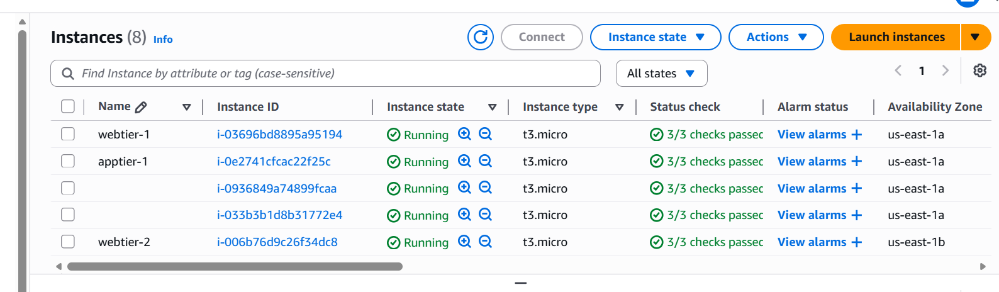
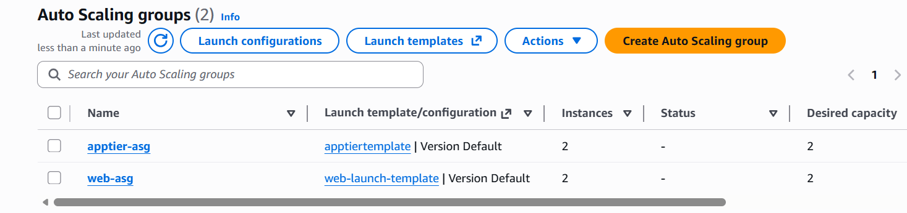
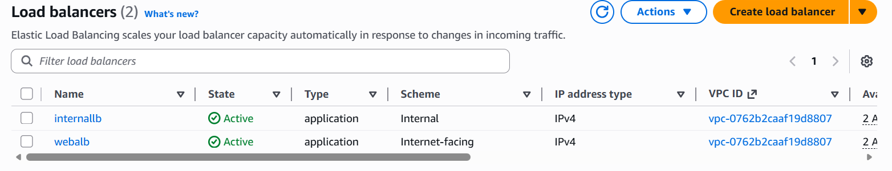
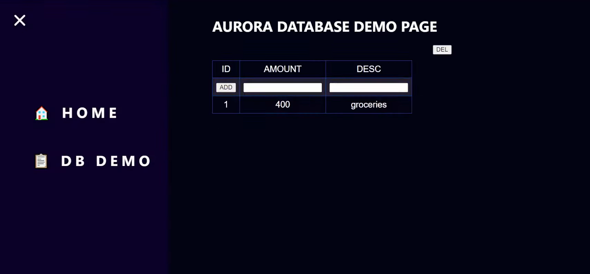
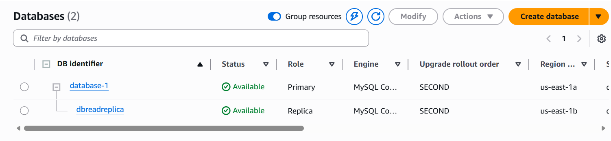

# AWS Three-Tier Web Application

A three-tier web application deployed on AWS using React, Node.js, NGINX, and Amazon RDS.

This project demonstrates deployment of a frontend, backend API, and database layer using AWS infrastructure components including EC2, Load Balancers, VPC networking, and RDS.

This project was implemented by following and customizing the AWS workshop below:

[AWS 3 Tier Workshop](https://github.com/aws-samples/aws-three-tier-web-architecture-workshop)

---

# Project Overview

This application follows the three-tier architecture pattern:

- Web Tier → React frontend served through NGINX
- Application Tier → Node.js + Express REST API
- Database Tier → Amazon RDS MySQL database

---

# Learning Objectives

This project provided practical hands-on experience with:

- AWS cloud architecture
- Multi-tier application deployment
- VPC networking and load balancing
- Reverse proxy configuration using NGINX
- REST API development and integration
- Secure database communication
- AWS infrastructure deployment

---

# Architecture Diagram

---

# Architecture Flow

1. Users access the frontend application through the public Application Load Balancer.
2. NGINX serves the React frontend and handles routing.
3. API requests are internally reverse proxied to the application tier.
4. The Node.js backend processes requests and business logic.
5. The backend communicates with the RDS MySQL database.
6. Responses are returned back to the frontend.

---

# Technology Stack

## Frontend
- React.js
- Styled Components
- React Router
- NGINX

## Backend
- Node.js
- Express.js
- MySQL

## AWS Services
- Amazon EC2
- Amazon RDS
- Application Load Balancer
- VPC
- Auto Scaling
- IAM
- Security Groups

---

# Key Features

- Three-tier architecture deployment
- Internal and external load balancing
- Reverse proxy configuration using NGINX
- REST API integration
- Transaction management system
- MySQL connection pooling
- Environment-based configuration
- Modular backend structure

---

# Project Structure

3TIER-AWS/

├── app-tier/
│   ├── DbConfig.js
│   ├── TransactionService.js
│   ├── index.js
│   ├── package.json
│   └── .env.example
│
├── web-tier/
│   ├── public/
│   │   ├── index.html
│   │   └── robots.txt
│   │
│   ├── src/
│   │   ├── App.js
│   │   ├── App.css
│   │   ├── global.js
│   │   ├── hooks.js
│   │   ├── index.css
│   │   ├── index.js
│   │   ├── theme.js
│   │   └── components/
│   │
│   └── package.json
│
├── nginx/
│   └── nginx.conf
│
├── screenshots/
│
└── README.md

---

# Improvements Beyond the Original Workshop

The original AWS workshop implementation was improved and refactored for better reliability and maintainability.

| Area | Improvements |
|------|------|
| Database Connections | Implemented MySQL connection pooling |
| SQL Security | Used parameterized queries to prevent SQL injection |
| Configuration | Added environment variable support |
| Error Handling | Added improved API response handling |
| Backend Structure | Cleaned and modularized backend logic |

---

# API Endpoints

## Health Check

GET /health

## Transaction APIs

POST   /transaction

GET    /transaction

GET    /transaction/id

DELETE /transaction/id

DELETE /transaction

---

# Project Screenshots

---

# Learning Outcomes

Through this project I gained practical experience with:

- Designing scalable cloud architectures
- Deploying applications on AWS
- NGINX reverse proxy configuration
- Backend API development
- Database integration
- Cloud networking concepts
- Load balancing and security
- Multi-tier deployment strategies

---

# License

This project was created for educational and learning purposes based on the AWS sample workshop.